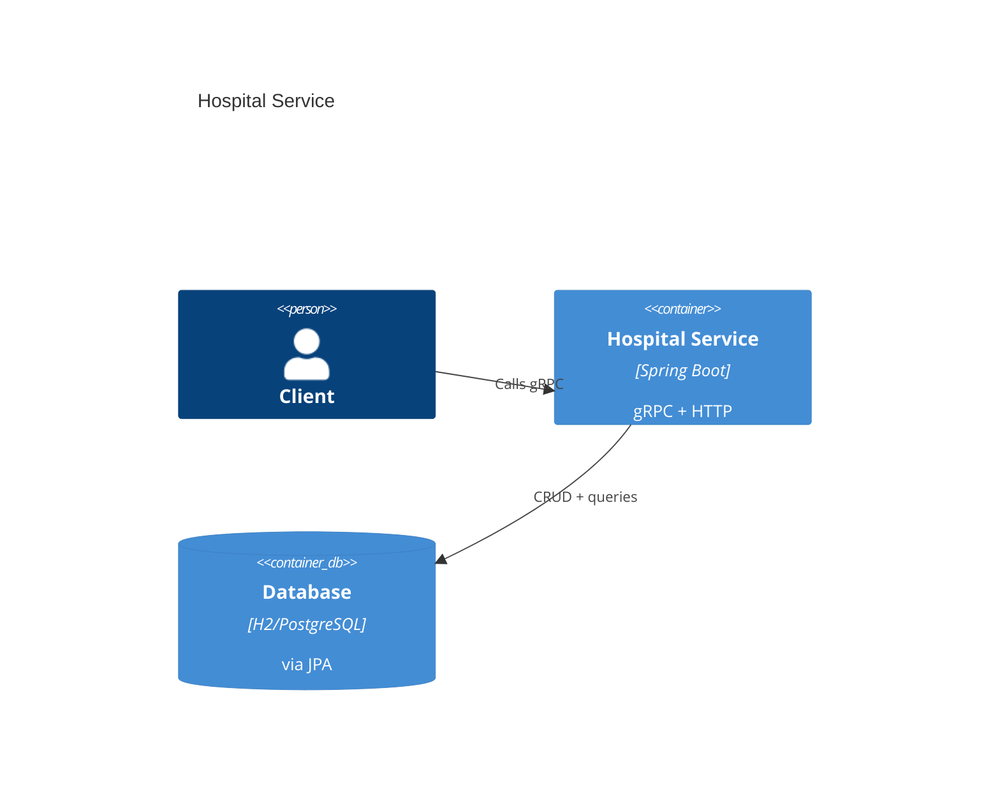

# Architecture

- **Spring Boot 3.2**
- **gRPC server** (port 9090) via net.devh grpc-spring-boot-starter
- **Spring Data JPA** with H2 (dev/test) or PostgreSQL (prod-ready)
- **Entities**: Hospital, Patient, Stay, Bill, with Many-to-Many between Hospital↔Patient
- **Services**: PatientService, HospitalService, StayService, BillingService
- **gRPC services** map to business services

## C4 Container Diagram (Mermaid)

