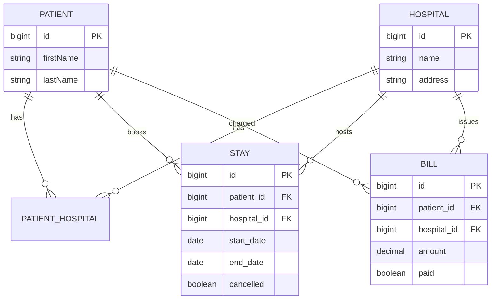

# Data Model

## Entities
- **Hospital**: id, name, address, Set<Patient>
- **Patient**: id, firstName, lastName, Set<Hospital>
- **Stay**: id, patient_id, hospital_id, startDate, endDate, cancelled
- **Bill**: id, patient_id, hospital_id, amount, paid

## Relationships
- Hospital ↔ Patient: Many-to-Many (join table `patient_hospital`)
- Patient ↔ Stay: One-to-Many
- Patient ↔ Bill: One-to-Many

## ER Diagram (Mermaid)

